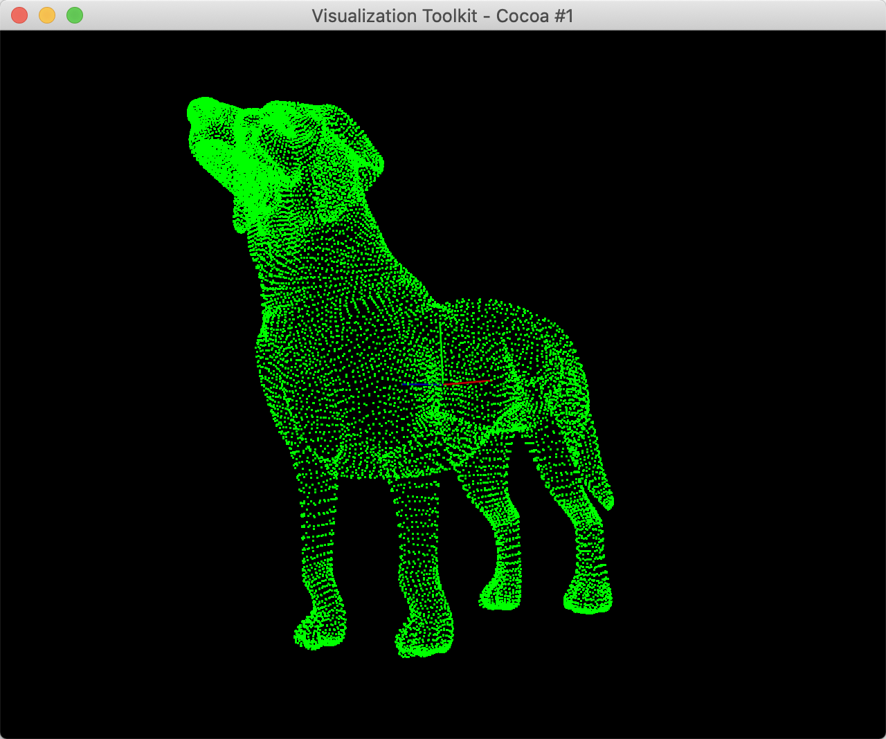

# PointCloudPlatform
### 1.简介  
这是一个基于PCL的点云处理平台，支持.obj .ply .pcd文件。  
所有的源代码都可以在/PointCloudPlatform/src下查看。  
macOS用Xcode打开/pcp.xcodeproj查看源代码。  

### 2.macOS下启动程序：
```
% cd your_path/PointCloudPlatform/Build/Products/Debug  
% ./pcp  
```
  
---  
### 3.读取点云数据并显示点云数据
```  
[Point Cloud Platform:]read your_point_cloud_data_path
[Point Cloud Platform:]show
```


--- 
### 4.归一化点云并显示  
```
[Point Cloud Platform:]read your_point_cloud_data_path
[Point Cloud Platform:]nor
[Point Cloud Platform:]show
```