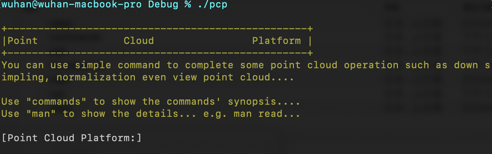
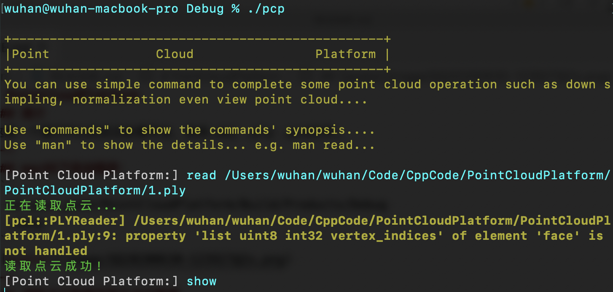
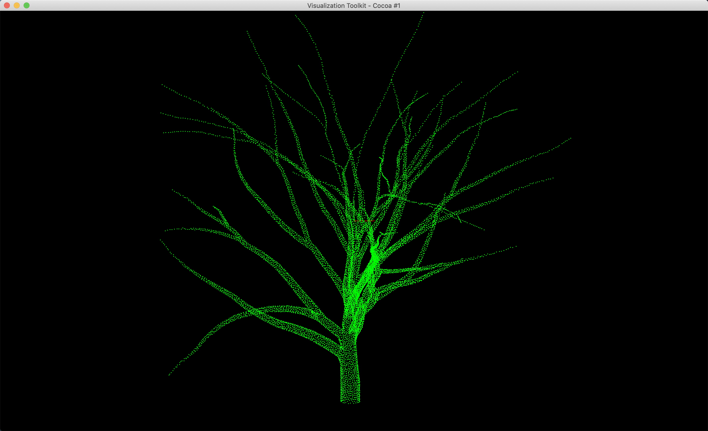
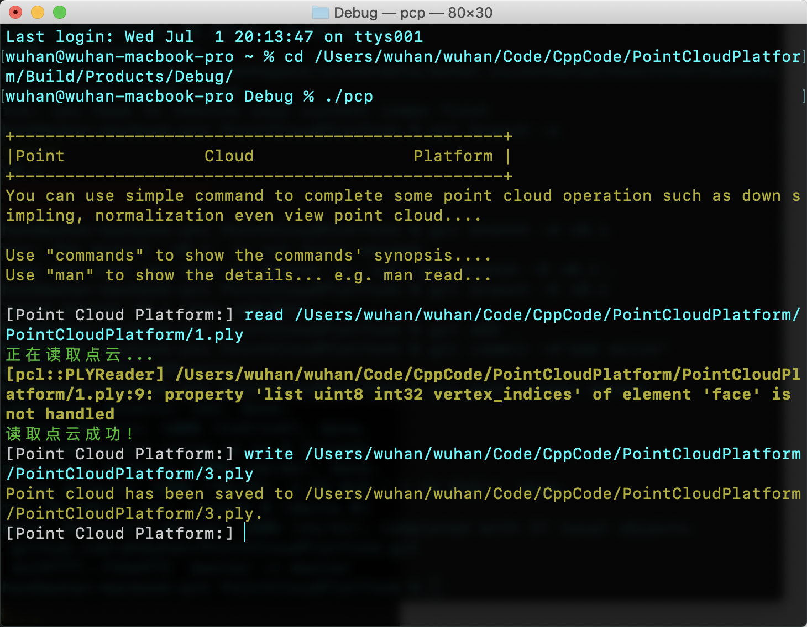
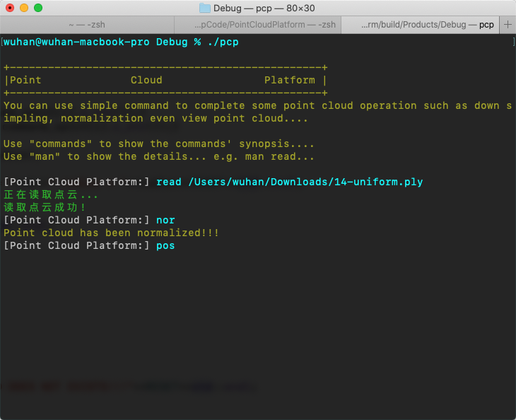
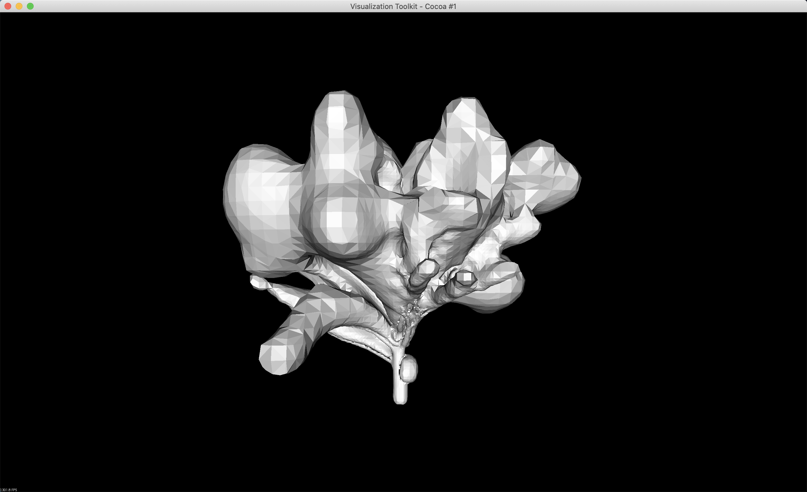
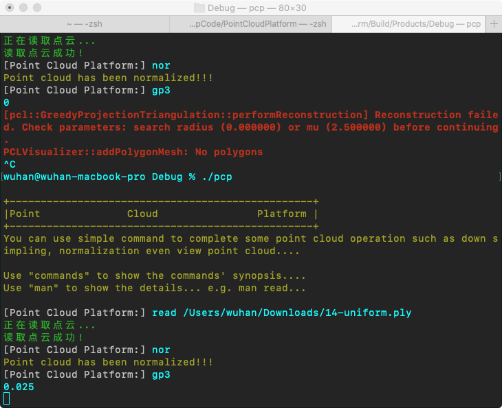
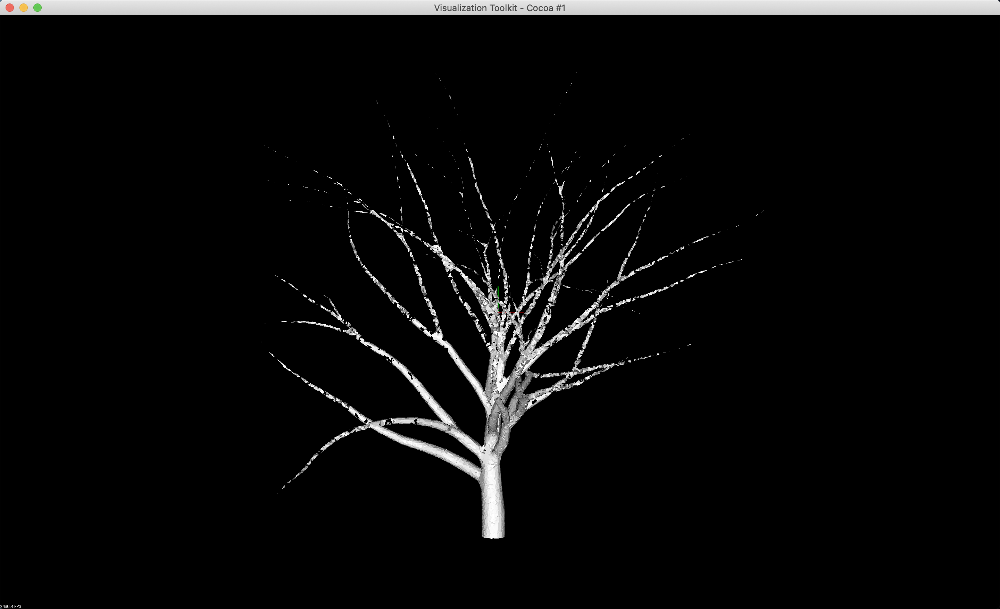

[TOC]
# PointCloudPlatform
### 1.简介  
这是一个macOS下的，基于[PCL](https://pointclouds.org/)的点云处理平台，支持.obj .ply .pcd文件。  
所有的源代码都可以在/PointCloudPlatform/src下查看。  
macOS可以用Xcode打开/pcp.xcodeproj查看源代码。  

---
### 2.macOS下启动程序：   
```
% cd your_path/PointCloudPlatform/Build/Products/Debug  
% ./pcp  
```
  

---
### 3.读取点云数据并显示点云数据  
```  
[Point Cloud Platform:]read your_point_cloud_data_path
[Point Cloud Platform:]show
```
  
  

---
### 4.归一化点云并显示  
```
[Point Cloud Platform:]read your_point_cloud_data_path
[Point Cloud Platform:]nor
[Point Cloud Platform:]show
```

---
### 5.存储处理后的点云  
```
[Point Cloud Platform:]write your_point_cloud_save_path
```
  

---
### 6.泊松重建  
```
[Point Cloud Platform:]read your_point_cloud_data_path
[Point Cloud Platform:]pos
```
  
  

---
### 7.贪婪投影三角重建  
```
[Point Cloud Platform:]read your_point_cloud_data_path
[Point Cloud Platform:]gp3
```
  
  
